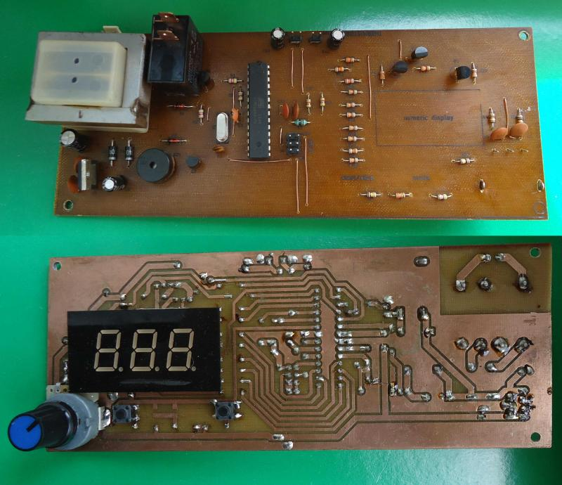

## Thermostat board on AVR atmega MCU
Digital temperature controler. Powered from mains network, can be build into DIY hardware or appiliances like fridge or oven. Easy to at home make, non precsion requiring THT desin with numeric 7-segment LED display, 2 control buttons, buzzer and rotary encoder for temp adjustment. Temperature is measured by one or two thermistors, all processing is done by atmega8 microcontroller or similar. Look also [here](http://github.com/markol/Thermostat-firmware) for firmware for this board. 

Design is made with KiCad, remember to add project footprint libraries (from *custom_fp.pretty* directory) when opening first time.

Currently project has only one master branch, other may appear when development proceed.

